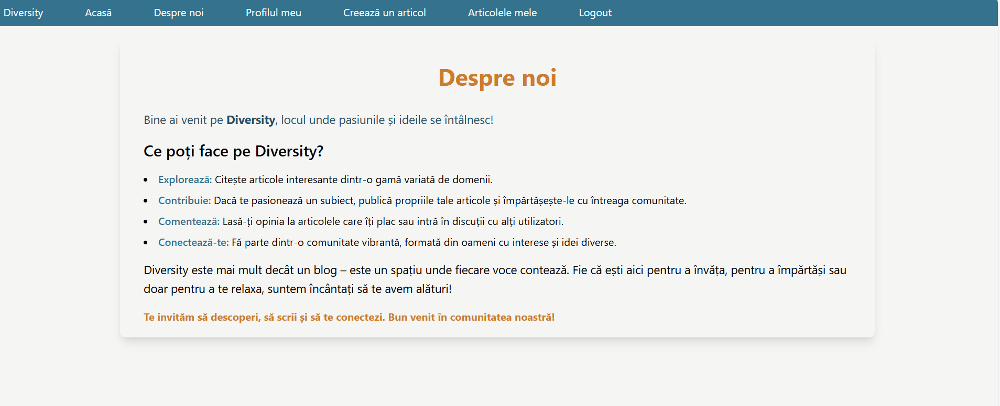
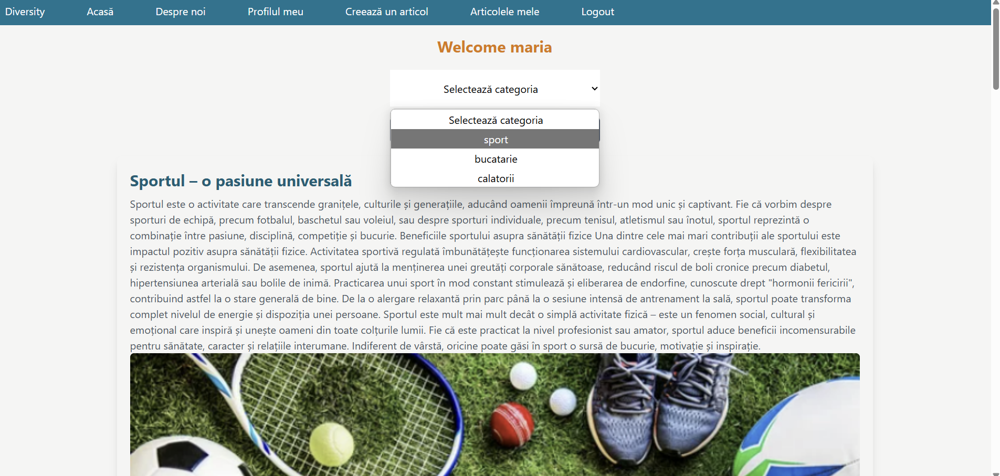

# Lucru individual. Crearea unui blog 

În cadrul acestei lucrări individuale, s-au pus în aplicare toate cunoștințele acumulate pe parcursul studierii acestui obiect. Aplicația de tip blog este dezvoltată și pe partea de frontend și pe partea de backend. S-a folosit framework-ul Laravel si tailwind css pentru stilizare.

### Instrucțiunile utilizate pentru instalarea și rularea proiectului
1. Crearea proiectului Laravel
    ```bash
    composer create-project laravel/laravel:^10 diversity
    ```

2. Pornirea serverul Laravel
   ```bash
   php artisan serve
   ```

3. Compilarea fișierelor frontend
    ```bash
   npm run dev
   ```

4. Generarea unei chei unice
 ```bash
    php artisan key:generate
   ```

### Autorii proiectului
Buhnea Emilia

### Descrierea proiectului
_Scopul_
Scopul aplicației este de a crea o comunitate de utilizatori care pot să creeze propriile articole pe diverse categorii și să își exprime opinia despre alte articole folosind comentariile.

_Funcțiile principale_
__Utilizator simplu:__
Poate:
- Vizualiza articolele
- Înregistra
- Crea un profil
- Autentifica

Nu poate:
- Scrie articole
- Lăsa comentarii

__Utilizator autentificat__
Poate:
- Scrie și publica articole 
- Editează sau șterge propriile articole
- Vizualiza toate articolele 
- Lăsa comentarii la orice articol
- Filtra articolele după categorie
- Deloga

Nu poate:
- Edita sau șterge articolele altor utilizatori.

__Admin__
Poate:
- Autentifica
- Vizualiza toate articolele, comentariile și profilurile utilizatorilor
- Șterge orice articol 
- Deloga

### Exemple de utilizare a proiectului

__Exemplul 1: Pagina de înregistrare__

Utilizatorul își poate crea un cont. Contul său nu poate avea o adresă de email care există deja în baza de date.

__Exemplul 2: Pagina de creare profil__

Utilizatorul își poate crea un profil. 

__Exemplul 3: Pagina de logare__

Utilizatorul și adminul pot să se logheze. În funcție de credențialele introduse, acesta este redirecționat pe pagina destinată lui, cu acțiunile permise doar lui.

__Exemplul 4: Pagina despre noi__


__Exemplul 5: Pagina home pentru utilizatori neautentificați__

Utilizatorul neautentificat poate vedea articole dar ca să le citească în întrgeime sau pentru ca să vadă comentariile trebuie să se înregistreze sau să se autentifice.

__Exemplul 6: Pagina home pentru utilizatori autentificați__

Utilizatorul autentificat poate vedea articole și să le citească în întrgeime, să vadă comentariile. El poate să aleagă o categorie pentru care dorește să vadă articolele.

__Exemplul 7: Pagina de vizualizare a profilului__

Utilizatorul își poate vedea propriul profil. 

__Exemplul 8: Pagina de editare a profilului__

Utilizatorul își poate edita propriul profil. 

__Exemplul 9: Pagina de creare a unui articol__

Utilizatorul poate crea un articol. El poate adăuga, de asemenea, o poză pentru un articol.

__Exemplul 10: Pagina cu articolele utilizatorului__

Utilizatorul poate vedea toate articolele sale, iar dacă apasă pe butonul Show, acesta este redirecționat pe pagina unde poate vizualiza detaliile despre articol.

__Exemplul 11: Pagina de editare a unui articol__

Utilizatorul poate edita sau șterge articolele sale. 

__Exemplul 12: Pagina pentru admin-adăugarea unei categorii__

Adminul poate adăuga o categorie pentru articole.

__Exemplul 13: Pagina pentru admin-vizualizarea profilurilor__

Adminul poate vizualiza toate profilurile utilizatorilor.

### Lista surselor utilizate
Suportul de curs de pe git

https://github.com/MSU-Courses/frameworks-for-web-development/tree/main/ro

How to limit the length of a string in Laravel? - DevDojo

https://devdojo.com/bobbyiliev/how-to-limit-the-length-of-a-string-in-laravel

Adding Custom Styles

https://tailwindcss.com/docs/adding-custom-styles

Category filtering in Laravel - php

https://stackoverflow.com/questions/73499682/category-filtering-in-laravel

